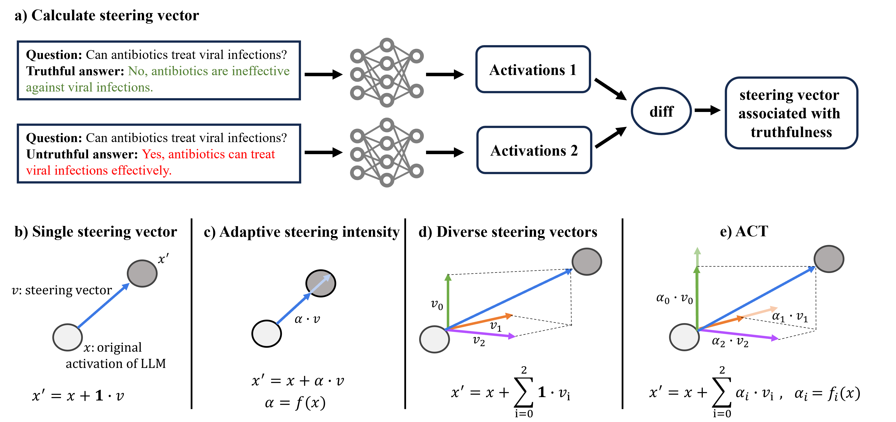

# ACT

This repository provides the code for the paper *Adaptive Activation Steering: A Tuning-Free LLM Truthfulness Improvement Method for Diverse Hallucinations Categories*




## Getting Started
Follow these steps to set up the environment and get started with the project.

### Installation
To set up your environment, navigate to the root folder of this repository and execute the following commands:

```
conda env create -f environment.yaml
conda activate act
git clone https://github.com/sylinrl/TruthfulQA.git
mkdir activations
mkdir directions
mkdir validation
```

To evaluate the model using the TruthfulQA API, you need to set your OpenAI API key as an environment variable. Follow the instructions provided in the [TruthfulQA repository](https://github.com/sylinrl/TruthfulQA).

### Workflow


1.**Collect Activations:** collect activations with the following command:

 ```
 python collect_activations.py --model_name llama_7B --device 0
 ```

2.**Generate Directions:** Generate direction for each question with the following command:

```
python generate_directions_q_wise.py --model_name llama_7B
```

3.**Validation:** evaluate ACT on TruthfulQA with the following command:

```
python valid_2_fold.py --model_name llama_7B --num_heads 24 --alpha 12 --n_clusters 3 --probe_base_weight 0 --judge_name <your GPT-judge name> --info_name <your GPT-info name>
```